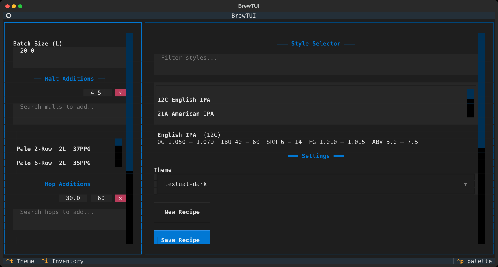

# brew-tui

An interactive homebrew recipe helper that runs in your terminal.

Built with [Textual](https://textual.textualize.io/). Type in ingredients
and see live OG, SRM, and IBU gauges against BJCP style guidelines.

[](https://github.com/hardyoyo/brew-tui/actions/workflows/ci.yml)
[](https://opensource.org/licenses/0BSD)



## Quick Start

```bash
pip install -e .
brew-tui
```

## Features

- **Live calculation** — OG, SRM, and IBU update as you type
- **BJCP style dashboard** — fuzzy-search official style guidelines; see where your recipe lands
- **Visual gauges** — colour-coded bars show below/in/above range at a glance
- **Ingredient browser** — fuzzy-search 29 malts and 26 hops; auto-fill Lovibond and AA%
- **Inventory wizard** — `Ctrl+I` for a conversational interview that builds your personal ingredient stash
- **Theme system** — pick from all built-in Textual themes via dropdown or `Ctrl+T`
- **Config file** — JSON config at `~/.config/brew-tui/config.json`, auto-generated on first run
- **Crash-safe** — empty or zero inputs are handled gracefully

## Documentation

- [Full usage guide](docs/usage.md) — inputs, style dashboard, gauges, ingredient browser, inventory builder, themes, config, keybindings, formulas

## Development

```bash
pip install -e ".[dev]"
pytest
```

## Contributing

Before committing, install the pre-commit hooks to auto-check formatting:

```bash
make install-pre-commit
```

This runs `ruff` and `black` on every commit so the CI stays green.

## License

BSD 0-Clause
